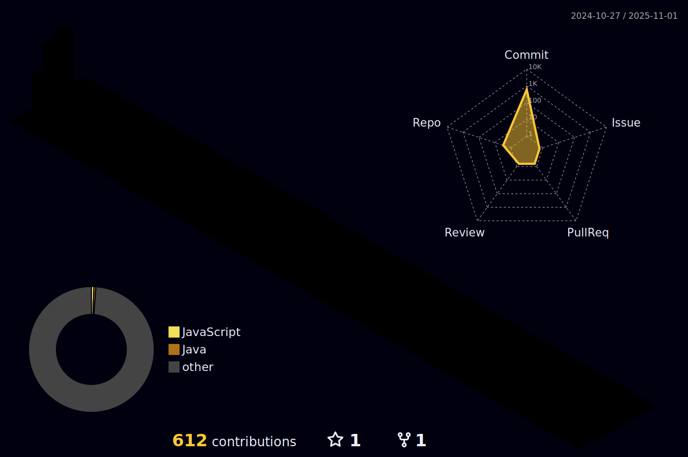

<!--  -->

 

  
<!--     -->

<!-- 

  
# Stacks ⚒️

### FrontEnd

  
  
  
  
  
  
  

### BackEnd

  
   
  
  
  
  
  
  

### DevOps

  
<!--    -->

<!--
  
  
  

### Tools

  
  
  
<!--    -->

<!--
  
  
  

  

# Contact Me ✉️

  
  
  
  

 

<!--   -->

